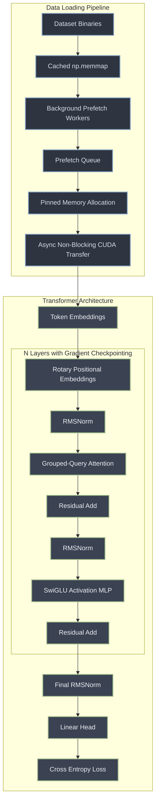

# nanoGPT (Production Grade)


## Overview

Welcome to the enterprise-grade refactor of **nanoGPT**. The original repository served as an incredible educational resource for understanding the mechanics of GPT architectures. However, to transition from a learning resource into a production-ready template for scalable Language Model (LLM) training, it required a major architectural overhaul.

This repository has been audited, refactored, and upgraded to support high-throughput, memory-efficient LLM training:
- **Architectural Modernization**: Absolute positional embeddings have been replaced with **Rotary Position Embeddings (RoPE)** for sequence extrapolation. Standard LayerNorms have been optimized into **RMSNorms** to accelerate memory-bound operations. The activation logic now leverages **SwiGLU** instead of GELU, significantly improving parameter utilization and gradient flow.
- **Inference Optimization**: Multi-Head Attention has been upgraded to support **Grouped-Query Attention (GQA)**, heavily reducing the Memory Bandwidth overhead of the KV-Cache during auto-regressive generation.
- **Asynchronous Data Loading Pipeline**: The legacy sequential data loader has been replaced with a multi-threaded **PrefetchDataLoader**. It caches file handles to avoid OS filesystem overhead, uses background daemon threads to stage batches concurrently, and leverages pinned memory to overlap CPU-to-GPU memory transfer with training execution.
- **Memory Optimization (Gradient Checkpointing)**: Integrated native activation/gradient checkpointing using `torch.utils.checkpoint` to trade minor compute for massive VRAM savings, allowing larger model sizing or batch sizes on consumer/enterprise hardware.
- **Robust Training & QA**: The `Trainer` implements strict boundary tests, catching NaN-loss occurrences to prevent model collapse, and uses modern non-deprecated `GradScaler` APIs. The test suite is fortified with tests checking thread lifecycles, memory mappings, and gradient checkpointing flows.

---

## Architectural & Data Pipeline Diagram

The following Mermaid diagram illustrates the training pipeline and transformer block execution:



---

## Installation & Setup

We mandate PyTorch 2.0+ to leverage `torch.compile` and Flash Attention natively.

```bash
# 1. Clone the repository
git clone https://github.com/your-org/nanoGPT.git
cd nanoGPT

# 2. Create a virtual environment
python -m venv venv
source venv/bin/activate  # On Windows: venv\Scripts\activate

# 3. Install the dependencies
pip install -r requirements.txt

# 4. Install development dependencies for the QA Suite
pip install -e ".[dev]"
```

## Running the QA Suite

The robust test suite validates boundary conditions, checks for tensor shape integrity under RoPE/GQA, tests the prefetching dataloader threads, and ensures fault-tolerant training execution.

```bash
# Set PYTHONPATH and run the entire suite with pytest
$env:PYTHONPATH="src"; pytest tests/ -v
```

## Training

The training configuration relies on the refactored `Trainer` class in `src/nanogpt/trainer.py` and the `PrefetchDataLoader`.

1. **Prepare Dataset**:
   ```bash
   python data/shakespeare_char/prepare.py
   ```
2. **Execute Training**:
   ```bash
   # Run with Gradient Checkpointing enabled to save memory
   python scripts/train.py config/train_shakespeare_char.py --gradient_checkpointing=True
   ```

*Note: For Distributed Data Parallel (DDP) executions across multiple nodes, use `torchrun`.*

## License

This project retains the MIT License. See the [LICENSE](LICENSE) file for full details.
