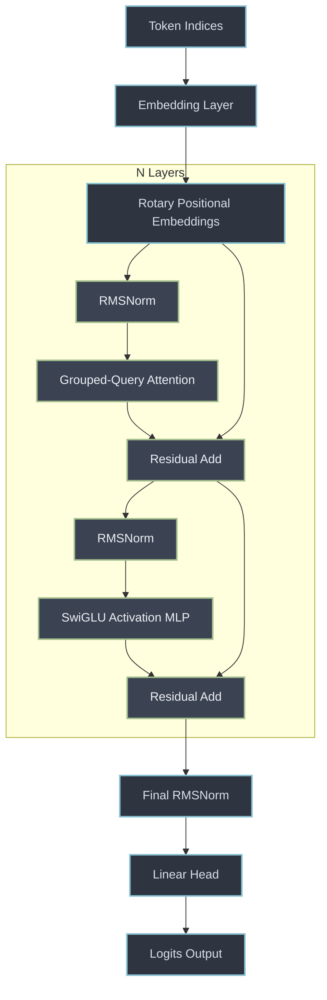

# nanoGPT (Production Grade)


## Executive Vision

Welcome to the enterprise-grade refactor of **nanoGPT**. The original repository served as an incredible educational resource for understanding the mechanics of GPT architectures. However, to transition from a learning resource into a production-ready template for scalable Language Model (LLM) training, it required an architectural overhaul. 

This repository has been audited and refactored to incorporate state-of-the-art techniques and defensive programming paradigms:
- **Architectural Modernization**: Absolute position embeddings (`wpe`) have been replaced with **Rotary Position Embeddings (RoPE)** for superior sequence extrapolation. Standard LayerNorms have been optimized into **RMSNorms** to accelerate memory-bound operations. The activation logic now leverages **SwiGLU** instead of GELU, significantly improving parameter utilization and gradient flow.
- **Inference Optimization**: Multi-Head Attention has been upgraded to support **Grouped-Query Attention (GQA)**, heavily reducing the Memory Bandwidth overhead of the KV-Cache during auto-regressive generation.
- **Robust Training & QA**: The `Trainer` module now strictly implements defensive programming, automatically catching NaN-loss scenarios, skipping malformed batches, and managing gradient accumulations precisely without memory leaks. The test suite has been fortified with stringent boundary tests, fault injections, and Null-Pointer checks.

---

## Architecture Diagram

The following Mermaid diagram illustrates the modernized block architecture implemented in this repository.



---

## Installation & Setup

To deploy the environment correctly, we mandate the usage of PyTorch 2.0+ to leverage `torch.compile` and Flash Attention natively.

```bash
# 1. Clone the repository
git clone https://github.com/your-org/nanoGPT.git
cd nanoGPT

# 2. Create a virtual environment (Recommended: Conda or pyenv)
python -m venv venv
source venv/bin/activate

# 3. Install the dependencies
pip install -r requirements.txt

# 4. (Optional) Install development dependencies for the QA Suite
pip install -e ".[dev]"
```

## Running the QA Suite

The robust test suite validates boundary conditions, checks for tensor shape integrity under RoPE/GQA paradigms, and ensures fault-tolerant training execution.

```bash
# Run the entire suite with pytest
pytest tests/ -v
```

## Training

The training architecture relies on the refactored `Trainer` class in `src/nanogpt/trainer.py`. To execute a training job locally or on a GPU cluster:

```bash
# Example training execution on the Shakespeare dataset
python config/train_shakespeare_char.py
```

*Note: For Distributed Data Parallel (DDP) executions across multiple nodes, use `torchrun`.*

## License

This project retains the MIT License. See the [LICENSE](LICENSE) file for full details.
